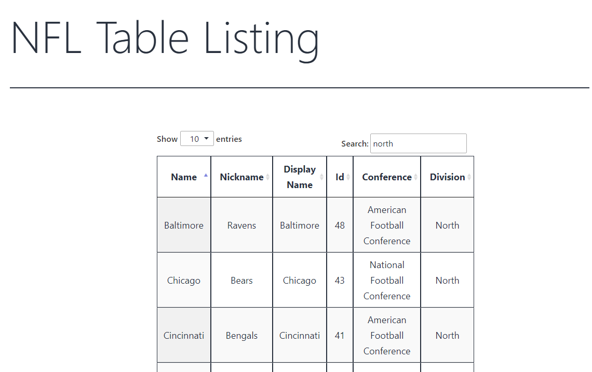

# Acme Sports Challenge

🏈 This is a WordPress plugin that displays a list of NFL teams. It includes functionality to retrieve data from an API, build a table, and enqueue styles and scripts. 

## 🚀 Installation

1. 📥 Download the plugin files and upload them to the `/wp-content/plugins/acmesports-plugin` directory, or install the plugin through the WordPress plugins screen directly. Alternativley you can zip them. 
2. 🚀 Activate the plugin through the 'Plugins' screen in WordPress
3. 📝 Use the shortcode `[nfl_data_teams_table]` to display the table on any page or post.

## 🎯 Usage

The plugin includes a shortcode that can be used to display the NFL teams table on any page or post. Simply add the shortcode `[nfl_data_teams_table]` to the content of the page or post where you want the table to appear.

## 📷 Screenshots

## 📜 Changelog

### Version 1.2.0:

- 🏗️ Simple boiler plate structure
- 📡 Call to api to retrieve data `get_teams_list_array()` and convert to php array
- 🏗️ Table builder to loop through results and build table  `nfl_teams_table_function()`
- 🎨 Enqueue styles using `wp_enqueue_style();` "table" and "page" stylings 
- 📥 Enqueue jquery (plugin datatables) `wp_enqueue_script();` datatables is jquery dependant
- 🧑‍💼 Admin Page to highlight to client the instructions. IE please use shortcode [nfl_data_teams_table] 
- 📦 Functionality to include required (css/js dependancies) [https://datatables.net/]

### Version 1.5.0

- 🔢 Re-Order column data putting id first
- 📈 Possibly utilize other endpoint + shortcode [nfl_data_team_table teamid="55"] to create linked page for more stats and information `<a href="team_info/?id=58">See More</a>`
- 📡 Create method/function `get_data($endpoint ='')`  to handle different endpoints.[https://delivery.oddsandstats.co/{$endpoint}]
- 📊 Additional Endpoint Parameter funcionality: `get_table_data($endpoint ='',$start = '', $limit = '', $sortby = '')` 
- 🚀 Implement jquery ajax internal endpoint to make it easier for serverside pagination of lots of results

### Version 2.5.0

- 🛠️ Make 1.5.0 versioned parameters available via a custom field inside admin.php?page so admins can easily change the following

